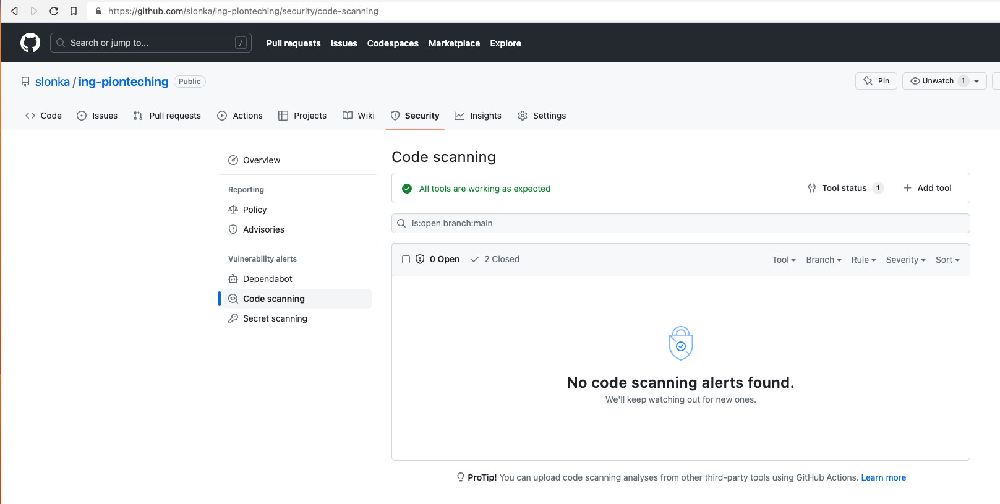

# Zielona Tesla za zielony kod

## Raport statycznej analizy bezpieczeństwa kodu SAST

[](https://github.com/slonka/ing-pionteching/actions/workflows/codeql.yml)



## Licencje używanych bibliotek

Szczegółowy raport licencji znajduje się w pliku [licences/index.html](licences/index.html) ([podgląd online](https://htmlpreview.github.io/?https://raw.githubusercontent.com/slonka/ing-pionteching/main/licences/index.html)).

## Licencja

Udzielona zgodnie z [regulaminem](./docs/Regulamin_konkursu_Zielona_Tesla_za_zielony_kod.pdf).

## Uruchomienie testów

```bash
./gradlew test
```

## Testy wydajnościowe

Przypadki testowe zostały wygenerowane za pomocą skryptów znajdujących się w `test/scripts` a następnie uruchomione używając [artillery.io](https://www.artillery.io/).

## Decyzje implementacyjne

Aby osiągnąć wysoką wydajność serwera HTTP został wykorzystany serwer "netty" a aby osiągnąć wysoką wydajność parsowania JSON został wykorzystany parser "fastjson".
Oba projekty cieszą się dużą popularnością a także są bardzo wydajne (co zostało potwierdzone wieloma benchmark-ami).
